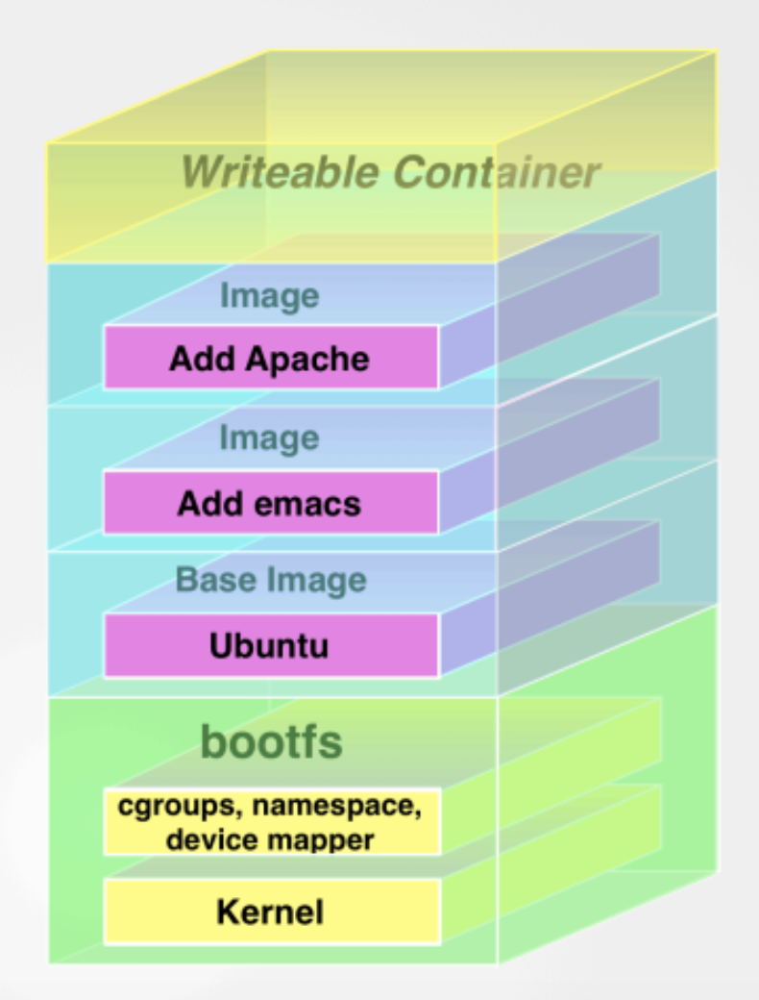
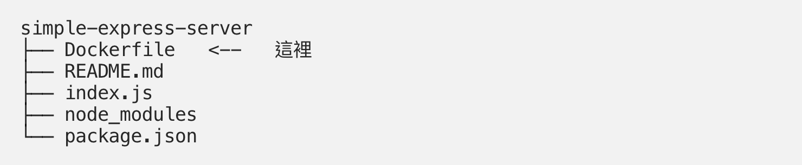
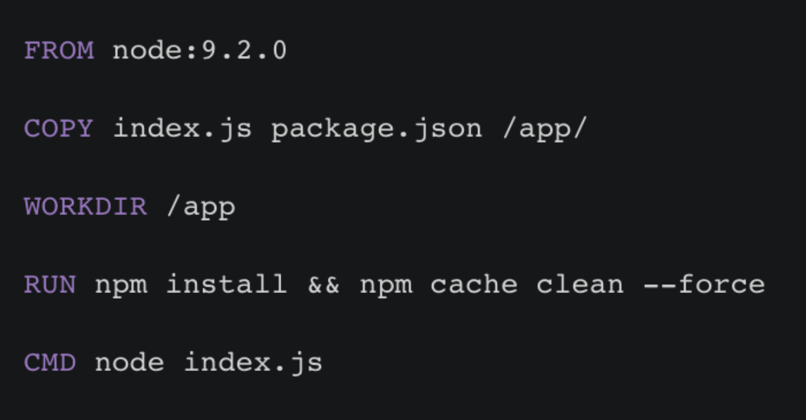
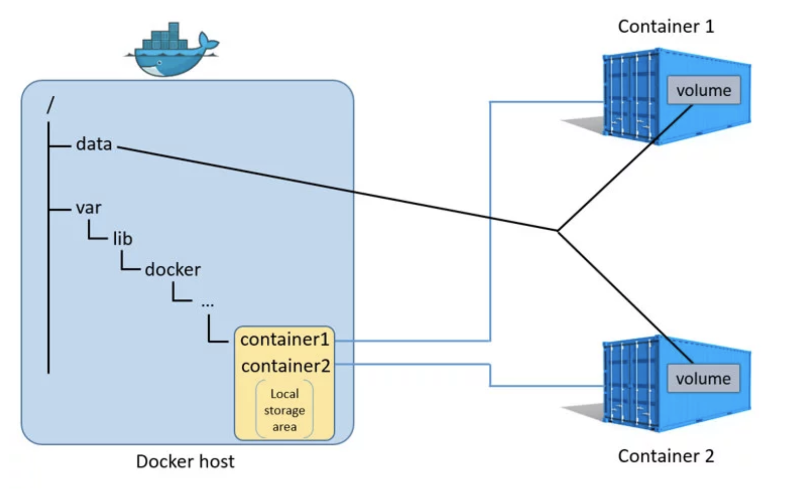

# Docker

### Hello World (Ubuntu 14.04)
reference: [blog.hellosanta.com.tw](https://blog.hellosanta.com.tw/%E7%B6%B2%E7%AB%99%E8%A8%AD%E8%A8%88/%E4%BC%BA%E6%9C%8D%E5%99%A8/%E6%95%99%E4%BD%A0%E4%B8%80%E6%AC%A1%E5%AD%B8%E6%9C%83%E5%AE%89%E8%A3%9D-docker-%E9%96%8B%E5%A7%8B%E7%8E%A9%E8%BD%89-container%C2%A0%E5%AE%B9%E5%99%A8%E4%B8%96%E7%95%8C)

```sh
$ uanme -r   # check to see if kernel version is > 3.10
$ sudo apt-get install curl   # install curl
$ curl -fsSL https://get.docker.com/ | sh   # install docker
$ docker -v   # verify docker installed
$ docker run hello-world   # should display "Hello from Docker"
$ docker run ubuntu:14.04 /bin/echo 'Hello world'   # disable interactive mode
$ sudo docker run -d ubuntu:14.04 /bin/sh -c "while true; do echo hello world; sleep 1; done"   # daemonized execution
```


Image Source: https://denibertovic.com/talks/supercharge-development-env-using-docker

### Docker CLI Example
(ref: https://denibertovic.com/talks/supercharge-development-env-using-docker)

```sh
$ docker login
$ docker pull denibertovic/postgres
$ docker run -d -t denibertovic/postgres
$ docker run -i -t debian /bin/bash
$ docker run -d -t postgres
$ docker run -d -t postgres:9.3
$ docker ps
$ docker logs 2344d8a4e916
$ docker stop 2344d8a4e916
$ docker kill 2344d8a4e916
$ docker start 2344d8a4e916
$ docker pull ubuntu
$ docker run -it ubuntu bash
```


### Docker Build Image

Dockerfile:
```sh
FROM      debian:wheezy
ENV DEBIAN_FRONTEND noninteractive

...

RUN apt-get -qq update
RUN apt-get -qq -y install postgresql-9.3 \
    postgresql-client-9.3 postgresql-contrib-9.3
ADD postgresql.conf /etc/postgresql/9.3/main/postgresql.conf
...

CMD /usr/local/bin/start_postgres.sh
```
```sh
$ docker build -t postgres .
$ docker commit <CID> username/postgresql
$ docker push username/postgresql
```
### Docker VS. Virtual Machines


Image Source: https://philipzheng.gitbooks.io/docker_practice

### Run OPENSUSE container


### Docker 是什麼

Docker 是個輕量級的虛擬化技術，底層使用 cgroup、chroot、namespace 實作，可以把你的應用程式連同環境一起打包，部屬的時候就不用再擔心環境的問題。

### Docker Image 層層疊加



### Docker Example

一個簡單的 simple-express-server，他會啟動一個 server 監聽 8080 port，到 127.0.0.1:8080 就可以看到 Hello World!





Dockerfile 完成後就可以開始 build image，在專案目錄下跑 docker build -t simple-express-server 就會根據 Dockerfile build 出你的 image

有了 image 後可以 docker run -p 3000:8080 simple-express-server 把 image 跑起來，在 container 內跑的就是剛剛設定的預設指令 node index.js，-p 3000:8080 則是把 container 內的 8080 port 跟外部的 3000 port 接通，如此一來只要用瀏覽器到 127.0.0.1:3000 就可以看到 Hello World!，這樣就完成 dockerize 了。

如果照上面跑 docker run -p 3000:8080 <image> 的話會把終端機卡住，所以部屬的時候都會跑在背景，要跑在背景只要加一個 -d 就可以了，變成 docker run -d <image>，下指令後會得到一個 container ID，要看 log 的話可以跑 docker logs <container ID>。
    
### Docker Volume - 1



你使用 volume 時，docker 會在你的本機上隨機新增一個資料夾（Local storage area），大部分會在 /var 底下，然後讓這個資料夾跟 container 裡面的某個資料夾互通。因為他們是互通的，所以當你 container 裡面那個資料夾有任何變更時，本地的資料夾也會跟著變，而且很重要的一點是：container 被刪掉時那個資料夾還會原封不動保留在那邊，我們就可以利用這個特性保留容器裡面的資料。

在啟動時加一個 -v 參數，就可以指定 volume 要跟容器內哪一個資料夾連通，這邊用的是 /db/data，實際上使用時可以換成資料庫存放資料的路徑。

Demo 一下：

1. 剛開始先確認 /db/data 裡面什麼檔案都沒有

2. 接著在容器內新增一個檔案

3. 最後再確認檔案在不在

```
docker volume create --name db-data
docker volume ls
docker run -v db-data:/db/data -it ubuntu ls -l /db/data
docker run -v db-data:/db/data -it ubuntu touch /db/data/file
docker run -v db-data:/db/data -it ubuntu ls -l /db/data
```

上面那種先 create 再使用的 volume 稱作 named volume，而現在要介紹另外一種叫做 host volume，用來直接指定某個資料夾跟容器內的資料夾連通。

來一段 demo：

1. 檢查 ~/app 內沒有 package.json

2. 指定本機的 ~/app 跟容器內的 /app</code> 連通，接著在容器內跑 yarn init

3. 跑完再回本機確認有沒有生出 package.json

```
ls app
docker run -v ~/app:/app --workdir /app node yarn init -y
ls app
```

### Docker Volume - 2

撰寫一個 Dockerfile 使用 VOLUME 指令，把 Docker的Image Build起來，然後啟動 Docker Container，把資料寫進在 Docker Container裡面，最後使用 docker inspect 指令，找到 Mapping 到實體主機的資料夾路徑，確認是否有看到之前寫在 Container 裡面的檔案。

Dockerfile 如下

```
FROM centos
VOLUME ["/storage"]
```

Build Image 指令如下

```
$ docker build -t volumetest .
```

啟動 Docker Container 指令如下

```
$ docker run -it volumetest /bin/bash
```

在實體主機上使用 docker inspect 指令，找到 Volume 在實體主機的資料夾路徑

```
docker inspect -f '{{.Mounts}}' e2987aaab700 
```

e2987aaab700 為 ContainerID，也可以使用指定 Container Name 的方式

### Docker Volume - 3

如何讓 Container 和 Container 之間的資料共享，可以使用以下的方式

啟動第一個 Container 指令如下

```
$ docker run -it -v /data --name=container1 centos /bin/bash
```

啟動第二個 Container 指令如下

```
$ docker run -it --volumes-from container1 --name=container2 centos /bin/bash
```
