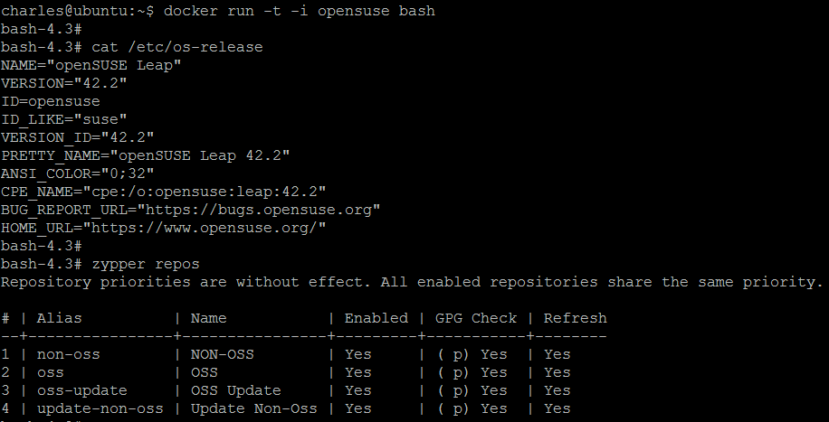

# Docker

### Hello World (Ubuntu 14.04)
reference: [blog.hellosanta.com.tw](https://blog.hellosanta.com.tw/%E7%B6%B2%E7%AB%99%E8%A8%AD%E8%A8%88/%E4%BC%BA%E6%9C%8D%E5%99%A8/%E6%95%99%E4%BD%A0%E4%B8%80%E6%AC%A1%E5%AD%B8%E6%9C%83%E5%AE%89%E8%A3%9D-docker-%E9%96%8B%E5%A7%8B%E7%8E%A9%E8%BD%89-container%C2%A0%E5%AE%B9%E5%99%A8%E4%B8%96%E7%95%8C)

```sh
$ uanme -r   # check to see if kernel version is > 3.10
$ sudo apt-get install curl   # install curl
$ curl -fsSL https://get.docker.com/ | sh   # install docker
$ docker -v   # verify docker installed
$ docker run hello-world   # should display "Hello from Docker"
$ docker run ubuntu:14.04 /bin/echo 'Hello world'   # disable interactive mode
$ sudo docker run -d ubuntu:14.04 /bin/sh -c "while true; do echo hello world; sleep 1; done"   # daemonized execution
```


Image Source: https://denibertovic.com/talks/supercharge-development-env-using-docker

### Docker CLI Example
(ref: https://denibertovic.com/talks/supercharge-development-env-using-docker)

```sh
$ docker login
$ docker pull denibertovic/postgres
$ docker run -d -t denibertovic/postgres
$ docker run -i -t debian /bin/bash
$ docker run -d -t postgres
$ docker run -d -t postgres:9.3
$ docker ps
$ docker logs 2344d8a4e916
$ docker stop 2344d8a4e916
$ docker kill 2344d8a4e916
$ docker start 2344d8a4e916
```


### Docker Build Image

Dockerfile:
```sh
FROM      debian:wheezy
ENV DEBIAN_FRONTEND noninteractive

...

RUN apt-get -qq update
RUN apt-get -qq -y install postgresql-9.3 \
    postgresql-client-9.3 postgresql-contrib-9.3
ADD postgresql.conf /etc/postgresql/9.3/main/postgresql.conf
...

CMD /usr/local/bin/start_postgres.sh
```
```sh
$ docker build -t postgres .
$ docker commit <CID> username/postgresql
$ docker push username/postgresql
```
### Docker VS. Virtual Machines


Image Source: https://philipzheng.gitbooks.io/docker_practice

### Run OPENSUSE container


